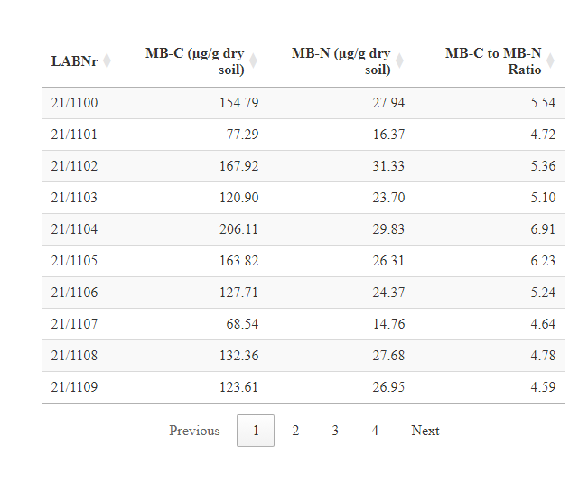
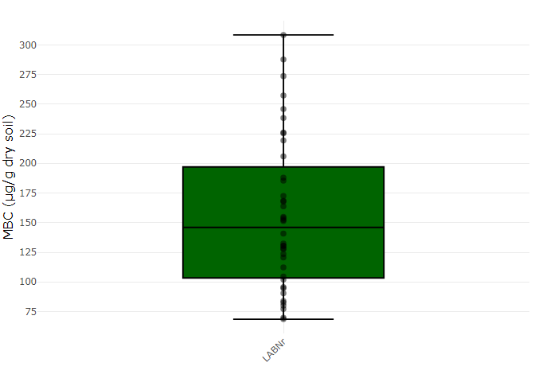
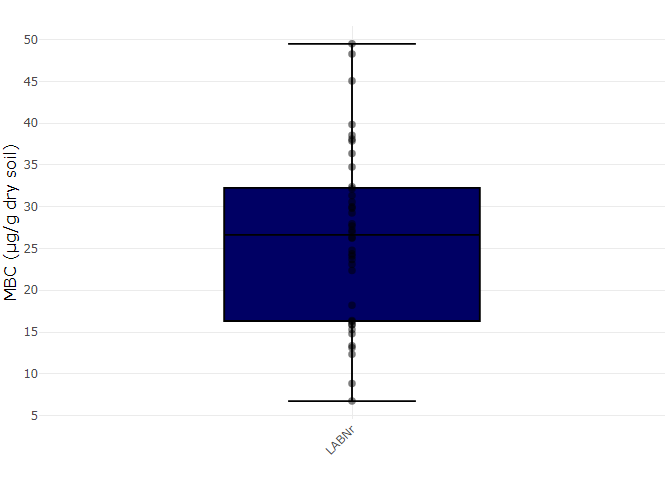
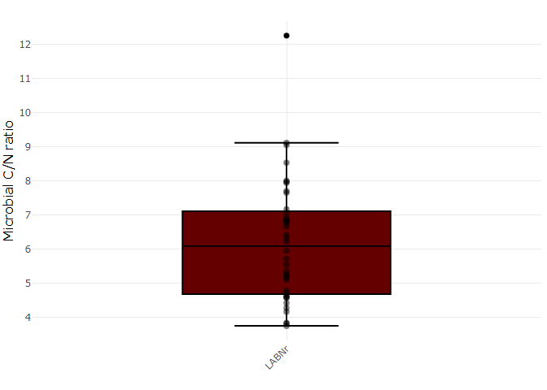

# Microbial Biomass Carbon & Nitrogen


Since HTML files cannot be directly viewed on GitHub, please download the repository to your local machine to generate the Quarto file and the HTML report. This will allow you to fully interact with the dynamic and interactive elements of the analysis. 

### Carbon (MB-C) and Nitrogen (MB-N)

This protocol calculates Microbial Biomass Carbon (MB-C) and Nitrogen
(MB-N) based on fumigated and non-fumigated extracts, measured with the
Shimadzu TOC-L Total Organic Carbon Analyzer.

## Requirements

- In order for this script to run correctly, you need to fill out the
  following Excel files:

  - [TOC & TDN
    data](Microbial_biomass_C_N/Microbial_biomass_C_N/raw_data.xlsx)
  - [weight
    data](https://github.com/farmse988/scripts/blob/main/Microbial_biomass_C_N/Microbial_biomass_C_N/Weighin.xlsx)

  Please ensure that the Excel files are properly filled out before
  running the script.

- Fumigated and non-fumigated TOC and TDN values

- Unique sample identifier (\`LABNr.\`)

- Weight before extraction and dry weight factor

- Extraction volume (mL)

- Blank TOC and TDN values

- Load the following R packages

``` r
library(readxl)
library(tidyr)
library(dplyr)
library(tidyverse)
library(DT)
library(plotly)
library(ggplot2)
library(writexl)
```

## Set working directory

## Load TOC & TDN values

``` r
raw_data <- read_excel("raw_data.xlsx", 
    sheet = "data")
```

### Data preperation

``` r
colnames(raw_data)[5] <- "LabNr.fum"

raw_data$LabNr.fum <- raw_data$LABNr.


raw_data <- raw_data %>%
  mutate(
    Warning = if_else(
      str_extract(`C/N nicht fumigiert`, "\\d+") == str_extract(`C/N fumigiert`, "\\d+"),
      NA_character_,
      "Warning: C/N mismatch"
    )
  )


raw_data <- raw_data %>%
  mutate(
    `C/N nicht fumigiert` = if_else(str_detect(`C/N nicht fumigiert`, "nf"), "not fumigated", "Attention"),
    `C/N fumigiert` = if_else(str_detect(`C/N fumigiert`, "fum"), "fumigated", "Attention")
  )


raw_data <- raw_data[,-9]


non_fum_data <- raw_data[,c(1:4)]
fum_data <- raw_data[,c(5:8)]

colnames(non_fum_data) <- c("LABNr", "lab_treatment", "TOC", "TDN")
colnames(fum_data) <- c("LABNr", "lab_treatment", "TOC", "TDN")

raw_data_long <- rbind.data.frame(non_fum_data, fum_data)
```

### Load data for weigh in and dry weight factor

``` r
weights <- read_excel("Weighin.xlsx", sheet = "data")
```

### Combine Datasets

``` r
combi_data <- merge(raw_data_long, weights, by = "LABNr")
```

# TOC & TDN Blank (mg/l)

``` r
TOC_Blank <- 2.095  # enter your value
TDN_Blank <- 0.5317 # enter your value
```

# Extraction volume (ml)

``` r
extraction_volume <- 25 # default 25
```

## Calculation TOC & TDN

``` r
calculation_data <- combi_data
calculation_data$TOC_mg_25ml <- (calculation_data$TOC-TOC_Blank)*(extraction_volume/1000)

calculation_data$TDN_mg_25ml <- (calculation_data$TDN-TDN_Blank)*(extraction_volume/1000)

calculation_data$TOC_mg_g_fresh_soil <- calculation_data$TOC_mg_25ml/calculation_data$weigh_in

calculation_data$TDN_mg_g_fresh_soil <- calculation_data$TDN_mg_25ml/calculation_data$weigh_in

calculation_data$TOC_mg_g_dry_soil <- calculation_data$TOC_mg_25ml/calculation_data$weigh_in_dry 

calculation_data$TDN_mg_g_dry_soil <- calculation_data$TDN_mg_25ml/calculation_data$weigh_in_dry
```

### Calculation microbial biomass

``` r
microbial_data <- calculation_data[,c(1,2,12,13)]


microbial_data_wide <- microbial_data %>%
  pivot_wider(names_from = lab_treatment,
              values_from = c(TOC_mg_g_dry_soil,TDN_mg_g_dry_soil))


microbial_data_wide$MBC <- ((microbial_data_wide$TOC_mg_g_dry_soil_fumigated-microbial_data_wide$`TOC_mg_g_dry_soil_not fumigated`))*1000


microbial_data_wide$MBN <- ((microbial_data_wide$TDN_mg_g_dry_soil_fumigated-microbial_data_wide$`TDN_mg_g_dry_soil_not fumigated`))*1000
```

# Final results

## Table

``` r
results <- microbial_data_wide[,c(1,6,7)]


results$MBC_to_MBN <- results$MBC / results$MBN

results_table <- results

colnames(results_table) <- c("LABNr", 
                       "MB-C (µg/g dry soil)", 
                       "MB-N (µg/g dry soil)", 
                       "MB-C to MB-N Ratio")

datatable(
  results_table,
  rownames = FALSE,
  options = list(
    pageLength = 10,               # Number of rows per page
    autoWidth = TRUE,             # Automatically adjust column width
    dom = 't<"bottom"p>'          # Simplify layout: table and pagination only
  ))%>%
  formatRound(columns = c("MB-C (µg/g dry soil)",
                          "MB-N (µg/g dry soil)",
                          "MB-C to MB-N Ratio"), digits = 2) 
```



## Plots

### Microbial Carbon

``` r
MBC <- ggplot(results, aes(y = MBC, x = "LABNr", text = LABNr)) +  # Add `text = LABNr`
  geom_boxplot(
    fill = "darkgreen",         # Set the boxplot color to green
    color = "black",            # Set the box color to dark green
    outlier.shape = 16,         # Default outlier shape for better visibility
    outlier.colour = "red",     # Set the outlier color to red
    outlier.size = 5            # Set the outlier size for visibility
  ) +
  geom_jitter(
    color = "black",            # Set jitter points color to black
    alpha = 0.5,                # Slight transparency for the points
    width = 0,                  # Remove width for jittering
    aes(text = LABNr)           # Pass `LABNr` for the hover text
  ) +
  scale_y_continuous(n.breaks = 10) +
  labs(
    x = "",
    y = "MBC (µg/g dry soil)"
  ) +
  theme_minimal() +
  theme(
    axis.text.x = element_text(angle = 45, hjust = 1),  # Rotate X-axis labels
    axis.title = element_text(size = 12),                # Set axis title font size
    plot.title = element_text(hjust = 0.5, size = 14)    # Center plot title and adjust size
  )

# Convert ggplot to interactive plotly plot
ggplotly(MBC, tooltip = "text")  # Show LABNr on hover
```



### Microbial Nitrogen

``` r
MBN <- ggplot(results, aes(y = MBN, x = "LABNr", text = LABNr)) +  # Add `text = LABNr`
  geom_boxplot(
    fill = "#000064",         # Set the boxplot color to green
    color = "black",            # Set the box color to dark green
    outlier.shape = 16,         # Default outlier shape for better visibility
    outlier.colour = "red",     # Set the outlier color to red
    outlier.size = 5            # Set the outlier size for visibility
  ) +
  geom_jitter(
    color = "black",            # Set jitter points color to black
    alpha = 0.5,                # Slight transparency for the points
    width = 0,                  # Remove width for jittering
    aes(text = LABNr)           # Pass `LABNr` for the hover text
  ) +
  scale_y_continuous(n.breaks = 10) +
  labs(
    x = "",
    y = "MBC (µg/g dry soil)"
  ) +
  theme_minimal() +
  theme(
    axis.text.x = element_text(angle = 45, hjust = 1),  # Rotate X-axis labels
    axis.title = element_text(size = 12),                # Set axis title font size
    plot.title = element_text(hjust = 0.5, size = 14)    # Center plot title and adjust size
  )
```

    Warning in geom_jitter(color = "black", alpha = 0.5, width = 0, aes(text =
    LABNr)): Ignoring unknown aesthetics: text

``` r
# Convert ggplot to interactive plotly plot
ggplotly(MBN, tooltip = "text")  # Show LABNr on hover
```



### Microbial Carbon to Nitrogen ratio

``` r
ratio <- ggplot(results, aes(y = MBC_to_MBN, x = "LABNr", text = LABNr)) +  # Add `text = LABNr`
  geom_boxplot(
    fill = "#640000",         # Set the boxplot color to green
    color = "black",            # Set the box color to dark green
    outlier.shape = 16,         # Default outlier shape for better visibility
    outlier.colour = "red",     # Set the outlier color to red
    outlier.size = 5            # Set the outlier size for visibility
  ) +
  geom_jitter(
    color = "black",            # Set jitter points color to black
    alpha = 0.5,                # Slight transparency for the points
    width = 0,                  # Remove width for jittering
    aes(text = LABNr)           # Pass `LABNr` for the hover text
  ) +
  scale_y_continuous(n.breaks = 10) +
  labs(
    x = "",
    y = "Microbial C/N ratio"
  ) +
  theme_minimal() +
  theme(
    axis.text.x = element_text(angle = 45, hjust = 1),  # Rotate X-axis labels
    axis.title = element_text(size = 12),                # Set axis title font size
    plot.title = element_text(hjust = 0.5, size = 14)    # Center plot title and adjust size
  )
```

    Warning in geom_jitter(color = "black", alpha = 0.5, width = 0, aes(text =
    LABNr)): Ignoring unknown aesthetics: text

``` r
# Convert ggplot to interactive plotly plot
ggplotly(ratio, tooltip = "text")  # Sh
```



## Write final data into an excel file

``` r
write_xlsx(results_table,"Your_final_microbial_data.xlsx")
```
